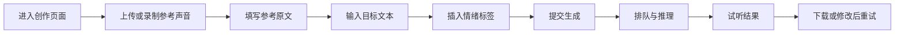
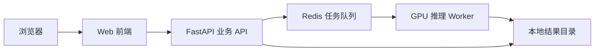

# RevolTTS Voice Studio MVP 项目方案

## 1. 项目目标

基于当前已经集成的 Fish Audio S2-Pro 模型，开发一个可公开体验的单人声音克隆产品。

用户可以上传或录制一段参考声音，填写对应原文，在目标文本中插入情绪标签或自由自然语言标签，然后生成、试听并下载克隆语音。

MVP 只聚焦以下三项模型能力：

1. 单人零样本声音克隆
2. `[tag]` 行内情绪控制
3. 自由自然语言标签

本阶段以“尽快可用、便于测试模型效果”为原则，暂不建设账号、计费、审核、举报、复杂权限和多人对话功能。

## 2. 产品定位

暂定名称：**RevolTTS Voice Studio**

一句话介绍：

> 上传一段声音，在文字中插入情绪指令，生成自然且富有表现力的 AI 语音。

核心体验：

```text
提供参考声音 → 编辑情绪脚本 → 生成语音 → 在线试听与下载
```

## 3. MVP 范围

### 3.1 必须实现

- 上传参考音频
- 使用浏览器录制参考音频
- 填写参考音频对应原文
- 输入目标生成文本
- 插入预设情绪标签
- 输入自由自然语言标签
- 调整少量生成参数
- 提交生成任务
- 显示排队和生成状态
- 在线播放生成结果
- 下载 WAV 或 MP3
- 桌面端和移动端适配
- 清晰展示生成错误及处理建议

### 3.2 暂不实现

- 多说话人和多人对话
- 多轨音频编辑
- 精确时间轴
- 用户登录和注册
- 付费与订阅
- 专属模型训练
- 声音社区和公开作品
- 视频配音
- 实时语音转换
- 复杂管理后台

## 4. 用户流程



首次使用不超过三个主要步骤：

1. 提供参考声音
2. 编辑情绪文本
3. 生成并试听

## 5. 页面规划

MVP 可以先实现一个完整的单页创作工作台，不必单独建设营销首页。

### 5.1 桌面端布局

```text
┌─────────────────────────────────────────────────────┐
│ RevolTTS Voice Studio                  服务状态      │
├──────────────────────┬──────────────────────────────┤
│ 参考声音              │ 情绪语音脚本                 │
│                      │                              │
│ 上传 / 录音           │ 文本编辑器                   │
│ 波形与试听            │ 常用标签                     │
│ 参考原文              │ 自由标签                     │
│                      │ 高级参数                     │
│                      │                              │
│                      │          生成语音            │
├──────────────────────┴──────────────────────────────┤
│ 任务状态 / 结果波形 / 播放 / 下载 / 再次生成         │
└─────────────────────────────────────────────────────┘
```

### 5.2 移动端布局

移动端使用单列结构：

1. 参考声音卡片
2. 参考原文
3. 目标文本编辑器
4. 情绪标签栏
5. 生成设置
6. 生成按钮
7. 任务状态
8. 结果播放器

生成按钮固定在底部操作区，但在软键盘弹出时不能遮挡文本输入。

### 5.3 响应式要求

- 手机：小于 768px
- 平板：768px～1024px
- 桌面：大于 1024px
- 手机端使用单列布局
- 主要点击区域不小于 44px
- 标签选择器在手机端使用底部抽屉
- 支持 `safe-area-inset-bottom`
- 页面不得产生横向滚动
- 文本编辑器在手机端至少占可视高度的 30%

## 6. 视觉设计方向

关键词：

```text
高级、克制、专业、沉浸、声音感
```

建议使用深色界面：

| 用途 | 建议颜色 |
|---|---|
| 页面背景 | `#080A0F` |
| 卡片背景 | `#11141C` |
| 主文字 | `#F5F7FA` |
| 次文字 | `#9299A8` |
| 品牌色 | 蓝紫渐变 |
| 成功状态 | 柔和青绿色 |
| 错误状态 | 低饱和红色 |

视觉元素：

- 音频波形作为主要品牌元素
- 卡片使用低对比度边框和轻微透明效果
- 圆角控制在 12px～18px
- 动画时长控制在 150ms～250ms
- 生成中使用动态波形，不展示虚假进度百分比
- 避免过量霓虹色、粒子和无意义循环动画

## 7. 参考声音模块

### 7.1 上传音频

支持格式：

- WAV
- MP3
- M4A
- WebM

界面显示：

- 文件名
- 音频时长
- 音频波形
- 播放和暂停
- 删除或重新选择

前端建议限制：

- 文件大小不超过 30MB
- 音频时长建议 10～30 秒
- 只允许单个文件

后端统一将输入转换为模型适用的单声道音频。

### 7.2 浏览器录音

录音功能包括：

- 请求麦克风权限
- 开始录音
- 实时显示时长
- 显示动态波形
- 停止录音
- 试听
- 重新录制

浏览器录音结果作为普通音频文件提交给后端。

### 7.3 参考原文

参考原文必须与参考音频中的实际说话内容一致。

页面提供说明：

> 请准确填写参考音频中的说话内容。原文与音频越匹配，克隆效果通常越稳定。

提供一段可直接朗读的示例：

> 你好，这是我的声音测试。今天的天气很好，我正在体验一种全新的语音创作方式。希望这段声音能够保持自然、清晰和稳定。

用户录制这段示例时，可以一键把示例填入参考原文。

## 8. 情绪文本编辑器

情绪文本编辑器是本产品的核心模块。

### 8.1 基本格式

模型接收的真实文本示例：

```text
我原本以为这只是个玩笑，[shocked]没想到竟然是真的。
```

编辑器需要对 `[tag]` 使用不同的颜色和背景，使其与普通文本明显区分。

### 8.2 预设标签

#### 情绪

| 中文名称 | 实际标签 |
|---|---|
| 开心 | `[happy]` |
| 兴奋 | `[excited]` |
| 悲伤 | `[sad]` |
| 生气 | `[angry]` |
| 惊讶 | `[surprised]` |
| 震惊 | `[shocked]` |
| 紧张 | `[nervous]` |
| 温柔 | `[gentle]` |

#### 语气

| 中文名称 | 实际标签 |
|---|---|
| 耳语 | `[whisper]` |
| 低沉 | `[low voice]` |
| 专业播报 | `[professional broadcast tone]` |
| 坚定 | `[firm tone]` |
| 神秘 | `[mysterious tone]` |

#### 音量与节奏

| 中文名称 | 实际标签 |
|---|---|
| 强调 | `[emphasis]` |
| 停顿 | `[pause]` |
| 短暂停顿 | `[short pause]` |
| 提高音量 | `[volume up]` |
| 降低音量 | `[volume down]` |
| 大声 | `[loud]` |
| 喊叫 | `[shouting]` |
| 放慢 | `[speak slowly]` |

#### 拟声和状态

| 中文名称 | 实际标签 |
|---|---|
| 笑 | `[laughing]` |
| 轻笑 | `[chuckle]` |
| 叹气 | `[sigh]` |
| 吸气 | `[inhale]` |
| 呼气 | `[exhale]` |
| 清嗓 | `[clearing throat]` |

### 8.3 插入方式

用户将光标放在文本中的任意位置，然后点击一个标签，标签插入到光标位置。

例如：

```text
输入前：我没想到你真的会回来。
操作：在“真的”前插入“惊讶”
输入后：我没想到你[surprised]真的会回来。
```

### 8.4 自由自然语言标签

提供“自定义标签”输入框：

```text
像发现秘密一样小声而兴奋地说
```

插入后形成：

```text
[像发现秘密一样小声而兴奋地说]
```

同时给出提示：

> 建议使用简短、具体的表达。英文标签通常更加稳定。

第一版不需要自动翻译或 AI 优化，直接把用户输入包装成方括号标签即可。

### 8.5 示例脚本

页面提供一键加载示例：

```text
今天本来是很普通的一天。[short pause]直到我打开了那扇门，[shocked]天啊！[whisper]里面竟然站着一个和我一模一样的人。
```

## 9. 生成设置

默认只显示产品化参数：

### 9.1 表达模式

| 模式 | Temperature | Top P |
|---|---:|---:|
| 稳定 | 0.6 | 0.7 |
| 平衡（默认） | 0.8 | 0.8 |
| 灵活 | 0.95 | 0.9 |

### 9.2 输出格式

- WAV
- MP3

如果当前运行环境不能稳定编码 MP3，MVP 第一版可以只开放 WAV，待接入 FFmpeg 后再开放 MP3。

### 9.3 高级设置

高级设置默认折叠：

- Temperature
- Top P
- Repetition Penalty
- Chunk Length
- Max New Tokens
- Seed
- Normalize

提供“恢复推荐设置”按钮。

## 10. 任务状态与排队

当前推理实例使用单任务串行生成，因此必须提供任务队列。

任务状态包括：

```text
pending       等待处理
processing    正在生成
encoding      正在编码音频
completed     生成完成
failed        生成失败
cancelled     已取消
```

页面文案示例：

```text
正在上传参考声音
任务已提交，前方还有 2 个任务
正在生成语音，请保持页面打开
正在处理音频
生成完成
```

前端每 1～2 秒查询一次任务状态。后续再升级成 SSE 或 WebSocket。

## 11. 结果播放器

生成完成后展示：

- 播放和暂停
- 音频波形
- 当前时间和总时长
- 音量控制
- 下载 WAV
- 下载 MP3（启用后）
- 复制当前脚本
- 使用相同参数重新生成
- 返回编辑文本

移动端使用底部播放器，生成完成后自动滚动到结果区域，但不要自动播放音频。

## 12. 系统架构

### 12.1 推荐架构



MVP 使用单机部署即可：

- Web 前端
- FastAPI
- Redis
- 一个 GPU Worker
- 本地文件存储

暂时不引入 PostgreSQL 和对象存储。任务信息可以放在 Redis，音频文件保存在本地目录，并设置定时清理。

### 12.2 为什么需要拆分推理 Worker

当前 `/ttsform` 直接在 Web 请求中执行同步推理，会长时间占用请求处理过程。

改造后：

1. API 接收文件和参数
2. API 创建任务并立即返回任务 ID
3. GPU Worker 从队列中取出任务
4. Worker 调用当前 `ModelManager.synthesize()`
5. Worker 保存结果并更新任务状态
6. 前端查询状态并获取结果

这样页面能够显示排队状态，也不会因为一次推理长期占用普通接口。

## 13. 技术选型

### 13.1 前端

- Next.js
- TypeScript
- Tailwind CSS
- React Hook Form
- WaveSurfer.js
- MediaRecorder API

### 13.2 后端

- Python 3.12
- FastAPI
- Pydantic
- Redis
- RQ、Dramatiq，或一个简单的自建 Redis Worker
- FFmpeg（格式转换）
- 当前 Fish Speech S2-Pro 推理代码

MVP 推荐优先选简单方案，不引入复杂微服务框架。

## 14. API 设计

### 14.1 服务状态

```http
GET /api/health
```

响应：

```json
{
  "status": "ok",
  "model": "s2-pro",
  "worker_ready": true
}
```

### 14.2 创建生成任务

```http
POST /api/generations
Content-Type: multipart/form-data
```

字段：

```text
text
reference_audio
reference_text
format
temperature
top_p
repetition_penalty
chunk_length
max_new_tokens
normalize
seed
```

响应：

```json
{
  "id": "gen_01J...",
  "status": "pending",
  "queue_position": 2
}
```

### 14.3 查询任务状态

```http
GET /api/generations/{id}
```

处理中：

```json
{
  "id": "gen_01J...",
  "status": "processing",
  "queue_position": 0,
  "created_at": "2026-07-18T10:00:00Z",
  "started_at": "2026-07-18T10:00:08Z"
}
```

完成：

```json
{
  "id": "gen_01J...",
  "status": "completed",
  "duration": 8.42,
  "audio_url": "/api/generations/gen_01J.../audio"
}
```

失败：

```json
{
  "id": "gen_01J...",
  "status": "failed",
  "error": {
    "code": "GENERATION_FAILED",
    "message": "没有生成有效音频，请缩短文本或更换参考声音后重试。"
  }
}
```

### 14.4 获取音频

```http
GET /api/generations/{id}/audio
```

返回音频文件。

### 14.5 取消等待任务

```http
DELETE /api/generations/{id}
```

只保证可以取消尚未开始的任务。推理已经开始后，MVP 可以暂不支持中途终止。

## 15. 文件目录规划

第一阶段建议在当前项目中采用以下结构：

```text
revoltts/
├─ frontend/                  # Next.js 前端
├─ backend/
│  ├─ app/
│  │  ├─ api/                 # HTTP 接口
│  │  ├─ core/                # 配置和公共模块
│  │  ├─ inference/           # ModelManager 封装
│  │  ├─ jobs/                # 队列任务
│  │  ├─ schemas/             # 请求与响应模型
│  │  └─ main.py
│  └─ tests/
├─ fish_speech/               # 当前推理代码
├─ checkpoints/s2-pro/        # 当前模型权重
├─ storage/
│  ├─ uploads/                # 临时参考音频
│  └─ outputs/                # 生成结果
├─ scripts/
├─ docker-compose.yml
├─ pyproject.toml
└─ README.md
```

## 16. 后端模块职责

### `api`

- 接收上传文件
- 校验请求参数
- 创建任务
- 查询任务状态
- 返回生成音频

### `inference`

- 加载 S2-Pro
- 加载 Codec
- 执行预热
- 编码参考音频
- 生成语义 Token
- 解码并输出波形

### `jobs`

- Redis 入队
- GPU Worker 消费任务
- 更新任务状态
- 保存结果文件
- 清理临时文件

### `schemas`

- 生成请求模型
- 任务状态模型
- 错误响应模型

## 17. 输入限制

即使暂不建设完整安全系统，也需要设置基本技术边界，避免服务因意外输入崩溃：

- 参考音频不超过 30MB
- 参考音频建议不超过 60 秒
- 参考文本不超过 2,000 字符
- 目标文本首版不超过 1,000 字符
- 自定义标签不超过 100 字符
- `max_new_tokens` 设置合理上限
- 一次只上传一个参考音频
- 任务队列设置最大长度

这些属于服务稳定性限制，不涉及内容审核。

## 18. 错误处理

需要定义用户能理解的错误：

| 错误码 | 用户提示 |
|---|---|
| `AUDIO_EMPTY` | 参考音频为空，请重新上传。 |
| `AUDIO_TOO_LARGE` | 参考音频文件过大。 |
| `AUDIO_UNSUPPORTED` | 当前无法识别该音频格式。 |
| `REFERENCE_TEXT_EMPTY` | 请填写参考音频对应原文。 |
| `TEXT_TOO_LONG` | 目标文本过长，请分段生成。 |
| `QUEUE_FULL` | 当前体验人数较多，请稍后重试。 |
| `MODEL_NOT_READY` | 模型正在启动，请稍后重试。 |
| `GENERATION_FAILED` | 本次没有生成有效音频，请调整内容后重试。 |

详细异常写入服务日志，前端只展示简洁提示。

## 19. 部署方案

### 19.1 单机 MVP

建议配置：

- Ubuntu 22.04 或 24.04
- NVIDIA 24GB 显存 GPU
- 32GB 以上系统内存，推荐 64GB
- Python 3.12
- CUDA 12.8 对应的 PyTorch 环境
- Node.js 20+
- Redis
- FFmpeg
- Nginx 或 Caddy

单张 GPU 只启动一个推理 Worker。

### 19.2 服务组成

```text
Nginx/Caddy
├─ /                 → Next.js
├─ /api/*            → FastAPI
└─ /generated/*      → 生成音频文件

Redis                → 任务状态与队列
GPU Worker           → S2-Pro 推理
```

### 19.3 启动顺序

1. 启动 Redis
2. 启动 GPU Worker 并加载模型
3. Worker 完成模型预热
4. 启动 FastAPI
5. 启动 Next.js
6. 启动反向代理

## 20. 开发阶段

### 阶段一：后端任务化

目标：让当前模型服务具备可靠的任务流程。

- 拆出 `ModelManager`
- 新增任务模型
- 接入 Redis
- 创建 GPU Worker
- 实现生成任务 API
- 实现状态查询 API
- 保存并返回音频
- 增加基础输入限制

交付结果：可以通过 API 提交任务、查询状态并下载结果。

### 阶段二：移动端优先工作台

目标：完成核心用户界面。

- 建立 Next.js 前端
- 完成响应式页面框架
- 完成参考音频上传
- 完成浏览器录音
- 完成参考原文输入
- 完成目标文本编辑器
- 完成生成状态展示
- 完成结果播放器

交付结果：手机和电脑都能完成一次完整生成。

### 阶段三：情绪标签体验

目标：突出产品核心差异。

- 标签分类面板
- 光标位置插入标签
- 标签高亮显示
- 自定义自然语言标签
- 示例脚本
- 推荐表达模式
- 相同参数再次生成

交付结果：普通用户不需要学习 Fish Speech 语法，也能使用情绪控制。

### 阶段四：部署和体验优化

目标：能够邀请用户公开试用。

- Docker 或标准化启动脚本
- Nginx/Caddy 配置
- 服务状态展示
- 队列满载提示
- 临时文件自动清理
- 日志与基础运行指标
- 全流程移动端测试
- Chrome、Safari 和微信内置浏览器测试

## 21. 验收标准

### 功能验收

- 用户可以上传 WAV、MP3 或录制参考音频
- 用户可以试听参考音频
- 用户可以填写参考原文
- 用户可以输入目标文本
- 用户可以在光标位置插入情绪标签
- 用户可以插入自定义自然语言标签
- 用户可以提交生成任务
- 页面可以展示等待、生成、完成和失败状态
- 用户可以播放生成结果
- 用户可以下载生成结果
- 用户可以修改文本后再次生成

### 移动端验收

- 375px 宽度下无横向滚动
- 主要操作可单手完成
- 软键盘不会遮挡当前输入和主要操作
- 录音、标签选择和播放器均可正常使用
- 页面刷新后可以通过任务 ID 恢复正在进行的任务

### 模型效果验收

使用固定测试集验证：

1. 中性单人文本
2. `[whisper]` 耳语
3. `[angry]` 生气
4. `[excited]` 兴奋
5. `[laughing]` 笑声
6. 句中插入标签
7. 一段文本包含两次情绪变化
8. 自由英文自然语言标签
9. 自由中文自然语言标签

每组至少生成三次，记录成功率、生成耗时、音色相似度主观评分和标签可感知程度。

## 22. 首版演示脚本

### 示例一：悬疑

```text
今天本来是很普通的一天。[short pause]直到我打开了那扇门，[shocked]天啊！[whisper in a trembling voice]里面竟然站着一个和我一模一样的人。
```

### 示例二：广告播报

```text
[professional broadcast tone]全新的语音创作体验正式上线。[excited]只需要一段声音，就能让每一句话拥有真实的情绪。
```

### 示例三：情绪变化

```text
[calm tone]我一直以为自己已经放下了。[short pause][sad]可当我再次看到那张照片，[whisper]我才发现，一切都没有结束。
```

## 23. MVP 最终定义

当产品达到以下状态，即可开始邀请用户体验：

> 用户在手机或电脑上上传或录制 10～30 秒参考声音，填写参考原文，在目标文本中插入预设 `[tag]` 或自由自然语言标签，提交后看到真实任务状态，最终在线播放并下载生成的克隆语音。

第一版成功的关键不是功能数量，而是以下四项体验：

1. 参考声音录制和上传足够简单
2. 情绪标签编辑器容易理解
3. 排队和生成反馈清晰
4. 最终音频可以方便试听和下载
