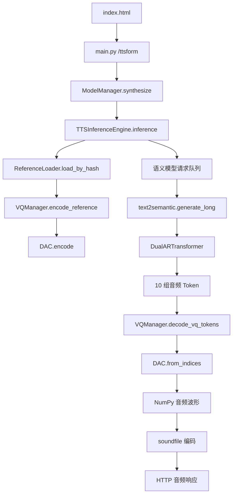

# RevolTTS 项目结构深度解析

## 1. 项目全貌

当前项目由五类内容组成：

1. RevolTTS 自己编写的轻量 API 和网页
2. 从 Fish Speech 上游复制的模型、推理和训练代码
3. Fish Audio S2-Pro 模型权重与分词器
4. Python 安装环境和包元数据
5. 一个尚未开始业务开发的 React/Vite 前端模板

真正参与当前声音克隆请求的代码范围并不大：

```text
main.py
  └─ fish_speech/inference_engine/
       ├─ reference_loader.py
       ├─ vq_manager.py
       └─ __init__.py
            ├─ fish_speech/models/text2semantic/
            ├─ fish_speech/models/dac/
            ├─ fish_speech/conversation.py
            ├─ fish_speech/content_sequence.py
            ├─ fish_speech/tokenizer.py
            └─ checkpoints/s2-pro/
```

训练、数据集、回调和国际化目录目前不参与 API 服务运行。

## 2. 当前请求的完整调用链



启动阶段：

1. Uvicorn 创建 FastAPI 应用。
2. FastAPI lifespan 创建 `ModelManager`。
3. `launch_thread_safe_queue()` 在后台线程加载 S2-Pro 语义模型。
4. `load_decoder_model()` 加载 `codec.pth`。
5. 创建 `TTSInferenceEngine`。
6. 可选执行一次无参考声音的模型预热。
7. 模型加载完成后才开始接受请求。

请求阶段：

1. `/ttsform` 读取目标文本、参考音频、参考原文和生成参数。
2. 参考音频经过 DAC 编码成 VQ Token。
3. 参考原文、参考 Token 和目标文本组成模型上下文。
4. S2-Pro 生成新的多码本音频 Token。
5. DAC 将音频 Token 解码成 44.1kHz 波形。
6. `soundfile` 将波形编码成目标格式并返回。

## 3. 根目录文件

### `.gitignore`

Git 忽略规则，排除：

- `.venv/`
- Python 缓存
- pytest 和 Ruff 缓存
- `*.egg-info`
- macOS `.DS_Store`

问题：没有排除 `web/node_modules/`、前端构建目录、临时上传和生成结果。正式初始化 Git 前应补充。

### `.project-root`

空标记文件，用于让 `pyrootutils` 或其他工具识别项目根目录。训练和工具代码可以从任意工作目录向上寻找该文件，确定配置和相对路径基准。

### `main.py`

当前 RevolTTS 服务的核心入口，也是唯一的业务后端文件。

主要组成：

- `Settings`：读取模型路径、设备、精度、编译和预热配置。
- `ModelManager`：加载模型、执行预热、串行调用推理。
- `select_device()`：CUDA 不可用时回退到 MPS、XPU 或 CPU。
- `write_audio()`：把 NumPy 波形编码为 WAV、MP3、Opus 或 PCM。
- `lifespan()`：FastAPI 启动时加载模型。
- `/`：返回根目录的单文件网页。
- `/health`：简单健康检查。
- `/ttsform`：接收 multipart 表单并生成声音。
- `uvicorn.run()`：直接执行 `python main.py` 时启动服务。

当前限制：

- 所有业务集中在一个文件中。
- 推理在异步接口中同步执行。
- 使用全局锁，一次只生成一个请求。
- 没有真正的任务队列。
- 没有流式响应。
- 只接受一份参考音频。

### `index.html`

当前 FastAPI 根路径实际返回的网页。

这是一个无构建步骤的单文件前端，包含：

- HTML 页面结构
- CSS 样式
- 参考音频文件上传
- `MediaRecorder` 浏览器录音
- 参考文本和目标文本输入
- 推理参数表单
- `fetch()` 调用 `/ttsform`
- Blob 音频结果播放和下载

优点是部署简单；缺点是组件化、状态管理和复杂移动端交互能力有限。

注意：根目录 `index.html` 与 `web/` 是两套完全独立的前端。目前服务使用的是这个文件，而不是 `web/`。

### `README.md`

RevolTTS 自己的使用说明，包含：

- 项目定位
- 依赖安装
- CUDA extra 选择
- 启动命令
- 环境变量
- `/health` 和 `/ttsform` 调用示例

文档内容主要面向 Linux。当前 Windows 环境中的终端曾出现字符显示乱码，但文件内容本身需要再确认编码是否统一为 UTF-8。

### `pyproject.toml`

Python 项目、依赖和打包配置。

主要职责：

- 定义包名 `revoltts` 和版本 `0.1.0`
- 声明 Python 版本范围
- 声明 PyTorch、FastAPI、音频和 Fish Speech 依赖
- 为 CPU、CUDA 12.6、12.8、12.9 配置不同 PyTorch 源
- 配置 setuptools 将 `main.py` 和 `fish_speech` 打包
- 把 YAML 和语言 JSON 作为包数据

当前项目实际推荐 Python 3.12，但配置写的是 `>=3.10`，范围比真实验证范围更宽。

### `uv.lock`

由 uv 生成的完整依赖锁文件。它固定每一个间接依赖的版本、下载地址和哈希，用于在其他机器上复现相同 Python 环境。

它不参与运行时业务逻辑，但部署时非常重要，不应手工编辑。

### `FISH_SPEECH_LICENSE`

Fish Speech 上游代码和模型对应的许可证副本。它定义权重和代码的使用约束，与 RevolTTS 自己的业务代码不是一回事。

### `MVP_PROJECT_PLAN.md`

本项目后续产品化的 MVP 方案文档，描述单人声音克隆、行内情绪标签、移动端页面、任务队列、API 和部署计划。它不参与程序运行。

### `PROJECT_STRUCTURE_ANALYSIS.md`

当前这份结构解析文档，不参与程序运行。

## 4. `checkpoints/s2-pro/` 模型目录

这个目录是项目能够离线运行 S2-Pro 的关键，约占项目本体绝大部分磁盘空间。

### `config.json`

S2-Pro 的核心模型结构配置。

从配置可以确认：

- 模型类型为 `fish_qwen3_omni`
- 主文本模型维度为 2560
- 主模型包含 36 层 Transformer
- 32 个注意力头、8 个 KV 头
- 文本上下文最大长度为 32768
- 音频快速解码器包含 4 层
- 音频使用 10 个 codebook
- 权重默认数据类型为 bfloat16
- 配置针对 Transformers 4.57.1

主模型负责沿时间轴生成主要语义码本，快速音频解码部分负责生成其余残差码本。

### `model-00001-of-00002.safetensors`

S2-Pro 语义模型权重的第一分片。Safetensors 是比 pickle 更适合分发模型权重的格式，支持快速和相对安全的张量加载。

### `model-00002-of-00002.safetensors`

S2-Pro 语义模型权重的第二分片。两个分片缺一不可。

### `model.safetensors.index.json`

分片索引文件，记录每一个模型参数位于哪个 `.safetensors` 文件。模型加载器通过它组合两个权重分片。

### `codec.pth`

音频 Codec 权重。它不是主语言模型，而是负责：

- 将参考音频编码成离散音频 Token
- 将 S2-Pro 生成的 Token 解码回音频波形

声音克隆和最终发声都依赖它。

### `tokenizer.json`

完整的 Hugging Face Fast Tokenizer 数据，包含普通文本词表、合并规则和大量音频语义特殊 Token。

### `tokenizer_config.json`

分词器行为配置，定义：

- Tokenizer 类
- BOS/EOS/PAD 设置
- 特殊 Token
- 模型最大长度
- 语义音频 Token 范围

其中包含 `<|voice|>`、`<|interleave|>`、`<|audio_start|>` 和数千个 `<|semantic:n|>` Token。

### `special_tokens_map.json`

Hugging Face 约定的特殊 Token 映射，帮助加载器识别结束符、填充符等特殊符号。

### `chat_template.jinja`

对话消息到模型输入文本的 Jinja 模板。用于将 system、user、assistant 等角色消息转换为模型能识别的特殊 Token 序列。

当前自定义推理主要通过 `Conversation` 自己编码，但该文件仍是模型包的标准组成部分。

### `README.md`

S2-Pro 模型卡本地副本，说明模型能力、架构、标签控制、多语言和使用方式。

### `LICENSE.md`

S2-Pro 权重随附的许可证。部署、传播或商业化时应以该文件和官方最新版许可证为准。

### `overview.png`

模型结构或功能介绍图片，仅用于文档展示，不参与推理。

## 5. `fish_speech/` 上游源码总览

这是从官方 Fish Speech 项目复制进来的 Python 包。它同时包含推理和训练能力，但 RevolTTS 当前只用到其中一部分。

### 顶层 `content_sequence.py`

定义模型对话中的内容单元：

- `TextPart`：普通文本
- `VQPart`：离散音频 Token
- `AudioPart`：原始音频
- `EncodedMessage`：编码后的张量和掩码
- `ContentSequence`：由文字和音频部分组成的消息序列

它解决的是“同一条模型消息中如何交错表示文字和声音”。多说话人、参考声音和生成音频都依赖这种抽象。

### 顶层 `conversation.py`

定义：

- `Message`：单条 system/user/assistant 消息
- `Conversation`：完整对话上下文

主要负责：

- 添加模型角色 Token
- 拼接文字和 VQ 内容
- 生成推理输入
- 创建音频位置掩码
- 可视化模型实际看到的 Prompt

S2-Pro 的多轮生成依赖它保留前一轮生成的音频 Token。

### 顶层 `tokenizer.py`

定义 `FishTokenizer`，封装文本和特殊 Token 编解码。

它既兼容早期 Fish Speech 的 tiktoken 词表，也服务于训练数据处理。当前 S2-Pro 推理的核心加载逻辑主要在 `llama.py` 中使用 Hugging Face Tokenizer，但该文件仍被训练配置引用。

### 顶层 `scheduler.py`

提供训练学习率计划：

- cosine warmup
- constant warmup

只用于训练，不参与当前推理 API。

### 顶层 `train.py`

Hydra + PyTorch Lightning 的统一训练入口。

负责：

- 读取 YAML 配置
- 实例化数据集、模型、优化器和回调
- 恢复 checkpoint
- 启动训练和验证
- 汇总指标

当前部署不调用它。删除训练能力时可以连同多个训练目录一起裁剪。

## 6. `fish_speech/inference_engine/`

这是当前 API 最直接依赖的高级推理封装。

### `__init__.py`

定义 `TTSInferenceEngine`，通过多重继承组合：

- `ReferenceLoader`
- `VQManager`

核心 `inference()` 流程：

1. 加载或编码参考声音
2. 设置随机种子
3. 向后台语义模型线程发送请求
4. 等待语义 Token 分段返回
5. 调用 DAC 解码每个分段
6. 拼接所有波形
7. 产生 `header`、`segment`、`final` 或 `error` 结果

虽然这里支持 streaming 分段，但 `main.py` 把 `streaming` 固定为 `False`。

### `reference_loader.py`

负责参考声音管理。

主要能力：

- 从上传的音频字节加载参考声音
- 从 `references/{id}` 目录加载保存的声音
- 使用 SHA-256 缓存已编码参考声音
- 自动转换为单声道
- 自动重采样到 Codec 采样率
- 添加、列出和删除保存的参考声音

当前 `/ttsform` 只使用 `load_by_hash()`；按 ID 保存声音的能力存在于底层，但没有暴露成 API。

### `vq_manager.py`

连接参考音频与 DAC Codec。

- `encode_reference()`：原始音频 → DAC VQ Token
- `decode_vq_tokens()`：模型生成 Token → 音频波形

这个文件是声音克隆中的“音频离散表示转换层”。

### `utils.py`

包含：

- `InferenceResult`：统一推理结果对象
- `wav_chunk_header()`：生成流式 WAV 文件头

非流式模式主要使用 `InferenceResult`。

## 7. `fish_speech/models/text2semantic/`

这个目录实现 S2-Pro 的核心“文字和参考声音 → 新音频 Token”阶段。

### `__init__.py`

包标记文件，基本没有业务逻辑。

### `inference.py`

当前推理链中最关键的文件之一。

包含四个层次：

1. 概率采样：top-p、temperature、多项式采样
2. Token 生成：逐 Token 解码和 KV Cache 使用
3. 长文本/多轮生成：拆分 speaker、分批并维护 Conversation
4. 服务线程：请求队列和后台模型 Worker

关键函数：

- `init_model()`：从 checkpoint 加载 S2-Pro
- `generate()`：执行单段自回归生成
- `generate_long()`：处理长文本、多 speaker 和多轮上下文
- `split_text_by_speaker()`：识别 `<|speaker:n|>`
- `group_turns_into_batches()`：按轮次和 UTF-8 字节数分批
- `launch_thread_safe_queue()`：启动唯一的模型工作线程

文件底部还包含命令行推理工具，可直接生成 `.npy` Token 和 WAV。

### `llama.py`

S2-Pro 主模型结构实现。

主要包含：

- 模型配置类
- KV Cache
- Transformer Block
- Attention
- FeedForward
- RMSNorm
- RoPE 位置编码
- `BaseTransformer`
- `DualARTransformer`

`DualARTransformer` 是 S2-Pro 的关键：

- Slow AR 沿时间轴生成主语义码本
- Fast AR 在每个时间点生成其余残差码本

它也负责：

- 从 config.json 创建模型
- 加载 safetensors 分片
- 加载 Hugging Face Tokenizer
- 兼容 Fish Qwen3 Omni 权重命名

### `lit_module.py`

定义 PyTorch Lightning 训练模块 `TextToSemantic`：

- 训练前向传播
- 损失计算
- 优化器与学习率调度器
- 训练和验证指标
- checkpoint 保存与加载逻辑

当前 API 推理不使用。

### `lora.py`

为文本到语义模型提供 LoRA 微调支持：

- 替换目标层
- 配置 rank 和 alpha
- 加载 LoRA
- 合并 LoRA 权重

当前 API 没有加载 LoRA。

## 8. `fish_speech/models/dac/`

DAC 是 S2-Pro 的神经音频 Codec。

### `__init__.py`

包标记文件。

### `inference.py`

DAC 的加载和命令行推理入口。

当前 `main.py` 直接调用这里的 `load_model()`：

1. 用 Hydra 加载 `modded_dac_vq.yaml`
2. 创建 DAC 模型结构
3. 从 `codec.pth` 加载权重
4. 把模型移动到目标设备并切换到 eval 模式

文件也支持独立执行音频编码或 Token 解码。

### `modded_dac.py`

DAC 的主要模型结构，包含：

- 音频 Encoder
- 音频 Decoder
- 因果卷积
- 反卷积
- Residual Unit
- Transformer 和注意力层
- KV Cache
- `DAC` 总模型

核心方法：

- `encode()`：音频波形 → 离散码本
- `from_indices()`：离散码本 → 音频波形

### `rvq.py`

Residual Vector Quantization 实现。

主要包含：

- 多级残差量化
- 码本查找
- 下采样与上采样
- VQ 结果结构
- 量化器相关卷积模块

它将连续音频特征压缩成有限的 Token ID，是语言模型能够“生成音频”的基础。

## 9. `fish_speech/configs/`

Hydra YAML 配置目录。

### `base.yaml`

通用训练配置：

- 结果目录
- checkpoint 路径
- Lightning Trainer
- GPU/DDP
- bf16 精度
- checkpoint、日志、进度条和梯度监控回调

只用于训练。

### `modded_dac_vq.yaml`

DAC 结构配置，当前推理实际使用。

定义：

- 44.1kHz 采样率
- Encoder/Decoder 维度和倍率
- Transformer 配置
- RVQ codebook 数量和大小
- 语义码本大小

修改此文件会改变 Codec 模型结构，必须与 `codec.pth` 权重匹配，不能随意调整。

### `text2semantic_finetune.yaml`

文本到语义模型微调配置，包含：

- 数据集路径
- Tokenizer
- 最大序列长度
- 模型 checkpoint
- 优化器
- 学习率计划
- 训练步数

当前配置仍引用旧的 `checkpoints/openaudio-s1-mini`，不是当前 S2-Pro 产品部署配置。

### `lora/r_8_alpha_16.yaml`

较小 LoRA 配置，rank 8、alpha 16。参数少、显存和存储开销较低。

### `lora/r_32_alpha_16_fast.yaml`

更高 rank 的 LoRA 配置，表达能力更强、训练参数更多，并针对较快训练设置目标层。

两个 LoRA 文件当前都不参与推理。

## 10. `fish_speech/datasets/`

训练数据管线，当前 API 不使用。

### `concat_repeat.py`

`ConcatRepeatDataset` 将多个 PyTorch Dataset 拼接，并支持按权重重复采样，用于平衡不同规模的数据集。

### `vqgan.py`

神经音频 Codec 训练数据：

- `VQGANDataset`：加载音频
- `VQGANCollator`：整理批次和长度
- `VQGANDataModule`：Lightning 数据模块

用于训练 DAC/VQGAN，不参与部署推理。

### `semantic.py`

文本到语义模型训练的主要数据管线。

负责：

- 读取文本与 VQ Token 数据
- 构造 system/user/assistant 对话
- 生成 speaker 信息
- 构造交错文本和音频样本
- 创建训练 labels 和 mask
- 处理流式和普通 Dataset
- 组装 Lightning DataModule

这是训练代码中最复杂的数据文件。

### `protos/text-data.proto`

训练样本的 Protocol Buffers 数据结构定义。描述文本、语义 Token、说话人等字段如何序列化。

### `protos/text_data_pb2.py`

由 protobuf 编译器根据 `.proto` 自动生成的 Python 类。不要手工编辑；修改应从 `.proto` 重新生成。

### `protos/text_data_stream.py`

提供 protobuf 流的读写工具：

- 写入长度前缀记录
- 顺序读取记录
- 打包和拆分数据流

用于大规模训练数据的顺序读取。

## 11. `fish_speech/callbacks/`

PyTorch Lightning 训练回调，当前 API 不使用。

### `__init__.py`

包标记文件。

### `grad_norm.py`

计算并记录训练梯度范数，用于诊断梯度爆炸、消失和训练稳定性。

### `progress_bar.py`

自定义 Lightning TQDM 进度条，让梯度累积条件下的步数和显示更准确。

## 12. `fish_speech/text/`

文本预处理模块。

### `__init__.py`

包标记文件。

### `clean.py`

基础文本清理，例如统一空白、标点和某些文字形式。主要用于训练数据预处理。

S2-Pro 强调无需复杂语言专用前处理，所以当前 API 没有显式调用这个文件；`[tag]` 也因此会原样进入模型。

## 13. `fish_speech/utils/`

跨训练和推理复用的辅助模块。

### `__init__.py`

导出常用工具，包括随机种子设置和 MPS autocast 上下文。当前推理使用。

### `context.py`

定义 `autocast_exclude_mps()`：

- CUDA/CPU 等设备使用 PyTorch autocast
- MPS 避免不兼容的 autocast 行为

DAC 解码时使用。

### `schema.py`

定义 API 和推理内部使用的 Pydantic 模型：

- TTS 请求
- 参考音频
- VQ 编解码请求
- 保存、列表和删除参考声音的请求/响应

当前 `main.py` 使用 `ServeTTSRequest` 和 `ServeReferenceAudio`。

### `file.py`

文件和参考声音辅助函数：

- 查找最新 checkpoint
- 音频文件转 bytes
- 读取 `.lab` 参考文本
- 按扩展名列文件
- 加载训练 filelist

参考声音缓存会调用它。

### `spectrogram.py`

线性频谱和 Log-Mel 频谱计算模块，主要服务音频训练和特征分析，当前主推理路径没有直接使用。

### `braceexpand.py`

实现类似 shell 的大括号表达式展开，例如：

```text
data/{a,b}/{1..3}.proto
```

用于批量展开训练数据路径。

### `instantiators.py`

根据 Hydra 配置动态创建 Lightning callbacks 和 loggers，只用于训练。

### `logger.py`

定义支持分布式 rank 的日志适配器，避免多 GPU 训练时每个进程重复打印相同日志。

### `logging_utils.py`

把模型、数据、优化器和训练器的超参数记录到 Lightning logger。

### `rich_utils.py`

使用 Rich 美化打印 Hydra 配置树，并检查训练标签配置。

### `utils.py`

训练任务通用辅助：

- 配置额外处理
- 任务异常包装
- 指标获取
- 随机种子设置

与 `utils/__init__.py` 中存在部分重复职责。

## 14. `fish_speech/i18n/`

Fish Speech 上游 WebUI/CLI 的国际化模块，当前根目录网页不使用。

### `__init__.py`

导出国际化对象。

### `core.py`

读取语言 JSON，并提供根据 key 返回翻译文本的 `I18nAuto`。

### `scan.py`

扫描 Python 源码中的国际化字符串，辅助维护翻译词条。

### `README.md`

国际化模块的维护说明。

### `locale/en_US.json`

英语界面文案。

### `locale/zh_CN.json`

简体中文界面文案。

### `locale/ja_JP.json`

日语界面文案。

### `locale/ko_KR.json`

韩语界面文案。

### `locale/es_ES.json`

西班牙语界面文案。

### `locale/pt_BR.json`

巴西葡萄牙语界面文案。

## 15. `revoltts.egg-info/`

这是 setuptools 安装项目后生成的包元数据，不是手写业务代码，通常不应提交到 Git。

### `PKG-INFO`

安装包名称、版本、描述、Python 要求、依赖和 README 的展开结果。

### `requires.txt`

安装包依赖列表，来自 `pyproject.toml`。

### `SOURCES.txt`

构建 Python 包时会包含的源文件清单。

### `top_level.txt`

顶层可导入模块名称，通常包含 `fish_speech` 和 `main`。

### `dependency_links.txt`

setuptools 的旧式依赖链接字段，通常为空。

整个目录可以删除并在下次安装时自动重新生成。

## 16. `.venv/`

Python 虚拟环境，包含已安装依赖和可执行脚本。

当前 `.venv` 使用 Unix/Linux 风格目录：

```text
.venv/bin/
.venv/lib/
.venv/lib64/
```

而当前宿主是 Windows，所以不能把它当作 Windows 原生虚拟环境直接使用。部署到 Linux 时可能可用，但更可靠的方式仍是在目标机器上通过 `uv sync` 重建。

主要子目录：

- `bin/`：Python、Uvicorn、FastAPI 等命令
- `lib/`：安装的 Python 包
- `lib64/`：64 位库链接或目录
- `share/`：包共享数据
- `pyvenv.cfg`：环境解释器来源和版本配置

不需要逐个分析其中数万个第三方文件，它们由 `uv.lock` 和 `pyproject.toml` 管理。

## 17. `__pycache__/`

Python 自动生成的字节码缓存，包括 `main.cpython-312.pyc` 等文件。

它可以删除，Python 下次运行时会自动生成，不应提交版本库。

## 18. `web/` 前端工程

这是一个 Vite + React + TypeScript 工程，但目前仍是 Vite 默认欢迎页面，尚未实现 RevolTTS 产品功能，也没有连接 `/ttsform`。

### `package.json`

定义前端项目：

- React 19
- React DOM 19
- Vite 8
- TypeScript 6
- ESLint

脚本包括：

- `npm run dev`
- `npm run build`
- `npm run lint`
- `npm run preview`

### `package-lock.json`

锁定全部 npm 直接和间接依赖版本。由 npm 自动维护，不应手工编辑。

### `index.html`

Vite 应用的 HTML 外壳，包含挂载 React 的 `#root` 节点和前端入口脚本。

它不是 FastAPI 当前返回的根目录 `index.html`。

### `src/main.tsx`

React 浏览器入口，将 `App` 挂载到 `#root`，并加载全局 CSS。

### `src/App.tsx`

当前仍是 Vite 默认演示组件：

- React/Vite Logo
- 计数器
- 文档链接

没有声音上传、标签编辑、API 调用或播放器业务。

### `src/App.css`

Vite 默认页面组件样式，对应 Logo、计数器和文档卡片。

### `src/index.css`

Vite 默认全局样式，定义字体、颜色、页面布局和基础元素。

### `src/assets/hero.png`

Vite 欢迎页的主视觉图片。

### `src/assets/react.svg`

React Logo，模板资源。

### `src/assets/vite.svg`

Vite Logo，模板资源。

### `public/favicon.svg`

浏览器标签页图标。

### `public/icons.svg`

默认模板使用的 SVG sprite 图标集合。

### `eslint.config.js`

前端 ESLint 规则，包含 JavaScript、TypeScript、React Hooks 和 React Refresh 检查。

### `vite.config.ts`

Vite 构建配置，启用 React 插件。目前没有配置 `/api` 开发代理。

### `tsconfig.json`

TypeScript 顶层项目引用配置，将浏览器应用和 Node/Vite 配置拆开检查。

### `tsconfig.app.json`

浏览器端 React 代码的 TypeScript 编译规则。

### `tsconfig.node.json`

Vite 配置等 Node 环境文件的 TypeScript 规则。

### `README.md`

Vite React 模板的默认说明，不是 RevolTTS 产品文档。

### `node_modules/`

npm 安装生成的第三方依赖目录，包含约数千个文件。

它不属于业务源码：

- 可以删除
- 运行 `npm install` 可以重建
- 不应提交 Git
- 分析项目时应忽略内部文件

## 19. 哪些内容当前真正有用

### 当前部署必需

```text
main.py
index.html
pyproject.toml
uv.lock
fish_speech/inference_engine/
fish_speech/models/text2semantic/
fish_speech/models/dac/
fish_speech/content_sequence.py
fish_speech/conversation.py
fish_speech/tokenizer.py
fish_speech/utils/schema.py
fish_speech/utils/context.py
fish_speech/utils/file.py
fish_speech/configs/modded_dac_vq.yaml
checkpoints/s2-pro/
FISH_SPEECH_LICENSE
```

### 产品开发即将使用

```text
web/
MVP_PROJECT_PLAN.md
```

但 `web/` 当前只是模板，需要完整开发。

### 只在训练或微调时有用

```text
fish_speech/train.py
fish_speech/scheduler.py
fish_speech/callbacks/
fish_speech/datasets/
fish_speech/configs/base.yaml
fish_speech/configs/text2semantic_finetune.yaml
fish_speech/configs/lora/
fish_speech/models/text2semantic/lit_module.py
fish_speech/models/text2semantic/lora.py
```

### 自动生成、可重建

```text
.venv/
__pycache__/
revoltts.egg-info/
web/node_modules/
```

### 当前没有使用

```text
fish_speech/i18n/
fish_speech/text/
fish_speech/utils/部分训练辅助文件
```

## 20. 当前目录存在的结构性问题

### 两套前端并存

- 根目录 `index.html` 是正在使用的旧网页。
- `web/` 是未开发的 React 模板。

产品开发后应明确迁移路径，避免长期维护两套 UI。

### 部署与训练代码混合

Fish Speech 的训练、微调和部署代码全部放在同一个 Python 包中。短期可以保留；产品稳定后可将推理所需代码做更清晰的边界管理，但不建议在尚未完成回归测试前直接删除上游文件。

### 自动生成目录已存在于工作区

`.venv`、`egg-info`、`node_modules` 和 `__pycache__` 会显著增加目录体积和搜索噪音。它们应该通过忽略规则管理，而不是当作项目源码。

### 当前项目不是 Git 仓库

无法确认：

- Fish Speech 上游具体 commit
- 哪些文件被修改过
- `web/` 何时创建
- 权重和代码是否严格对应同一版本

在正式开发前应初始化版本管理，并记录上游来源和版本。

### 产品 API 与模型层耦合

`main.py` 同时负责：

- 配置
- 模型生命周期
- 推理锁
- HTTP 参数
- 文件读取
- 音频编码
- 错误映射
- Uvicorn 启动

后续应拆分为 API、推理服务、任务队列和音频工具四层。

## 21. 推荐的下一步整理顺序

1. 初始化 Git，并完善 `.gitignore`。
2. 记录 Fish Speech 上游 commit 或发布版本。
3. 保留当前 `main.py` 作为可工作的基线版本。
4. 为当前 `/health` 和 `/ttsform` 添加最小回归测试。
5. 将 `ModelManager` 移入独立后端模块。
6. 将推理请求改成任务模式。
7. 在 `web/` 中替换 Vite 模板，开发产品页面。
8. 前端完成后停止从根目录返回旧 `index.html`。
9. 确认产品不需要训练能力后，再评估是否裁剪训练代码。

## 22. 一句话理解每层职责

```text
main.py                         把模型包装成 HTTP 服务
index.html                     当前简易操作页面
web/                           未来产品前端，目前只是模板
inference_engine/              编排完整声音克隆流程
models/text2semantic/          把文字和参考声音变成新音频 Token
models/dac/                    在真实音频和音频 Token 之间转换
conversation.py               构造文字与音频交错的对话上下文
content_sequence.py           定义对话里的文字、音频和 VQ 内容
checkpoints/s2-pro/            模型权重、Codec 和分词器
datasets/、callbacks/、train.py 训练与微调工具
configs/                       模型结构和训练配置
utils/                         推理和训练共用辅助能力
i18n/                         上游界面翻译
.venv、node_modules、egg-info   可重新生成的环境与元数据
```
